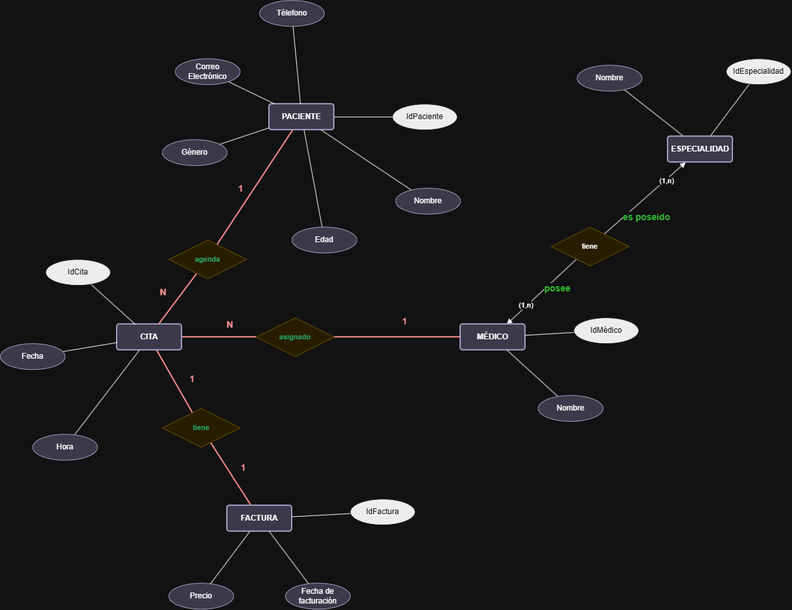

# 🗒️ Registro de Trabajo en Clase - Taller X

## 📆 Fecha de la sesión
_Indique la fecha de la clase en que se trabajó este taller._

## 👥 Integrantes presentes
- Brayan Presiga
- Julian Aguirre
- Jorge Alarcon

## 🧠 Actividades realizadas en clase

Durante la sesión el equipo trabajó sobre el caso base de la Clínica Salud Viva, siguiendo la metodología de 4 pasos propuesta en la guía del taller (identificar entidades → definir atributos y clave primaria → trazar relaciones con su verbo → asignar cardinalidad).
 
- **¿Qué se discutió con el equipo?** Se identificaron las cinco entidades centrales del dominio clínico: `PACIENTE`, `CITA`, `MÉDICO`, `ESPECIALIDAD` y `FACTURA`. Se discutió cuál era el rol de cada una dentro del flujo de atención (agendamiento → atención médica → facturación) y qué atributos eran indispensables para representar cada entidad sin sobrecargar el modelo.
- **¿Qué decisiones de modelado se tomaron?**
  - Se definió `CITA` como entidad intermedia que conecta a `PACIENTE` con `MÉDICO`, en lugar de relacionar directamente paciente-médico, ya que la cita es el evento real que contiene fecha y hora.
  - Se separó `ESPECIALIDAD` de `MÉDICO` como entidad independiente (y no como atributo), porque una especialidad puede ser poseída por varios médicos y tiene sus propios atributos (`IdEspecialidad`, `Nombre`).
  - `FACTURA` se modeló como entidad dependiente de `CITA` (relación "tiene", 1 a 1), asumiendo que cada cita genera una única factura.
  - Se asignaron las cardinalidades: `PACIENTE (1) — agenda — (N) CITA`, `CITA (N) — asignado — (1) MÉDICO`, `CITA (1) — tiene — (1) FACTURA`, `MÉDICO (1,n) — posee — ESPECIALIDAD`, `ESPECIALIDAD (1,n) — es poseído — tiene`.
- **¿Qué herramientas se usaron?** El boceto se construyó directamente en formato digital (herramienta tipo draw.io) usando la notación de diamante para relaciones y óvalos para atributos, marcando en blanco los atributos que corresponden a llave primaria (`IdPaciente`, `IdCita`, `IdMédico`, `IdEspecialidad`, `IdFactura`).
- **¿Qué parte del trabajo se alcanzó a desarrollar?** Se completó el ERD del caso base (entidades, atributos, relaciones y cardinalidades) para las cinco entidades. Quedó pendiente el diagrama de contexto de negocio (actores, sistemas y flujos de información) y la adaptación del modelo al dominio del cliente real.

## 🧩 Boceto inicial del modelo

## 🔁 Tareas definidas para complementar el taller

Anote las responsabilidades acordadas entre los miembros del equipo para completar la entrega final:

| Tarea asignada | Responsable | Fecha estimada |
|----------------|-------------|----------------|
| Modelado final en draw.io | BRAYAN PRESIGA | 10/08 |
| Redacción del informe     | JORGE ALARCON | 11/08 |
| Investigación y referencias | JULIAN AGUIRRE | 12/08 |

---

_Este documento resume el trabajo colaborativo realizado durante la sesión del taller X en el curso AREM - Universidad de La Sabana._
